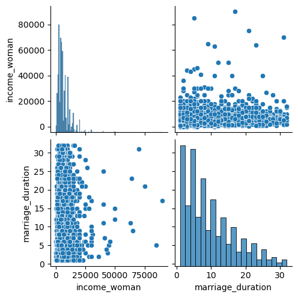
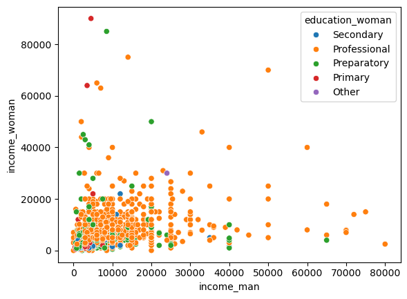
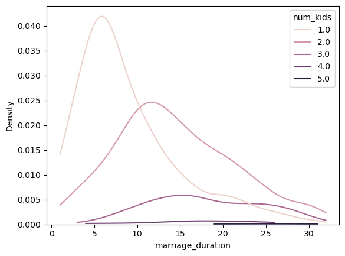
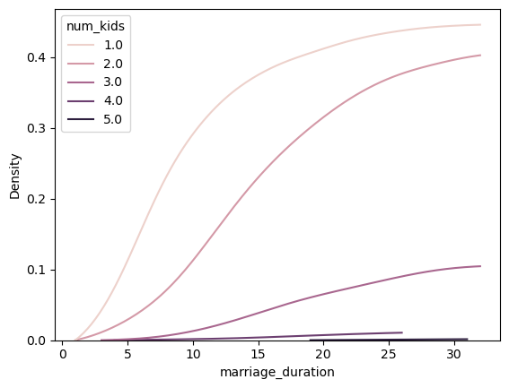

                                                 Analyse de la situation matrimoniale 


```python
# Importer les bibliothèques nécessaires
import pandas as pd
import matplotlib.pyplot as plt
import seaborn as sns

# Charger le fichier CSV depuis l'URL
url = 'https://raw.githubusercontent.com/SORADATA/Python/refs/heads/main/Dataset/divorce.csv'
divorce = pd.read_csv(url)

# Afficher un aperçu des premières lignes du DataFrame
print("Aperçu des premières lignes du dataset :")
print(divorce.head(), "\n")

# Afficher les informations sur le DataFrame
print("Informations sur le dataset :")
divorce.info()
print("\n")

# Afficher les statistiques descriptives du dataset
print("Statistiques descriptives :")
print(divorce.describe(), "\n")


```

    Aperçu des premières lignes du dataset :
      divorce_date     dob_man education_man  income_man   dob_woman  \
    0   2006-09-06  1975-12-18     Secondary      2000.0  1983-08-01   
    1   2008-01-02  1976-11-17  Professional      6000.0  1977-03-13   
    2   2011-01-02  1969-04-06   Preparatory      5000.0  1970-02-16   
    3   2011-01-02  1979-11-13     Secondary     12000.0  1981-05-13   
    4   2011-01-02  1982-09-20  Professional      6000.0  1988-01-30   
    
      education_woman  income_woman marriage_date  marriage_duration  num_kids  
    0       Secondary        1800.0    2000-06-26                5.0       1.0  
    1    Professional        6000.0    2001-09-02                7.0       NaN  
    2    Professional        5000.0    2000-02-02                2.0       2.0  
    3       Secondary       12000.0    2006-05-13                2.0       NaN  
    4    Professional       10000.0    2007-08-06                3.0       NaN   
    
    Informations sur le dataset :
    <class 'pandas.core.frame.DataFrame'>
    RangeIndex: 2209 entries, 0 to 2208
    Data columns (total 10 columns):
     #   Column             Non-Null Count  Dtype  
    ---  ------             --------------  -----  
     0   divorce_date       2209 non-null   object 
     1   dob_man            2209 non-null   object 
     2   education_man      2205 non-null   object 
     3   income_man         2209 non-null   float64
     4   dob_woman          2209 non-null   object 
     5   education_woman    2209 non-null   object 
     6   income_woman       2209 non-null   float64
     7   marriage_date      2209 non-null   object 
     8   marriage_duration  2209 non-null   float64
     9   num_kids           1333 non-null   float64
    dtypes: float64(4), object(6)
    memory usage: 172.7+ KB
    
    
    Statistiques descriptives :
             income_man  income_woman  marriage_duration     num_kids
    count   2209.000000   2209.000000        2209.000000  1333.000000
    mean    7922.986410   6793.164545           9.606609     1.672918
    std     7693.796497   6562.928689           7.266696     0.732858
    min        3.000000      3.500000           1.000000     1.000000
    25%     3600.000000   3000.000000           4.000000     1.000000
    50%     6000.000000   5000.000000           8.000000     2.000000
    75%    10000.000000   8000.000000          14.000000     2.000000
    max    80000.000000  90000.000000          32.000000     5.000000 
    
    

                                        Les corrélations 


```python

Divorce["marriage_date"] = pd.to_datetime(Divorce["marriage_date"])

# Définir la colonne "marriage_year"
Divorce["marriage_year"] = Divorce["marriage_date"].dt.year

# Créer un graphique en ligne montrant le nombre moyen d'enfants par année de mariage
sns.lineplot(data=Divorce, x="marriage_year", y="num_kids")

# Afficher le graphique
plt.xlabel("Année de mariage")
plt.ylabel("Nombre moyen d'enfants")
plt.title("Nombre moyen d'enfants par année de mariage")
plt.show()

```


    

    


```python
divorce.corr
```


    <bound method DataFrame.corr of      divorce_date     dob_man education_man  income_man   dob_woman  \
    0      2006-09-06  1975-12-18     Secondary      2000.0  1983-08-01   
    1      2008-01-02  1976-11-17  Professional      6000.0  1977-03-13   
    2      2011-01-02  1969-04-06   Preparatory      5000.0  1970-02-16   
    3      2011-01-02  1979-11-13     Secondary     12000.0  1981-05-13   
    4      2011-01-02  1982-09-20  Professional      6000.0  1988-01-30   
    ...           ...         ...           ...         ...         ...   
    2204   2006-10-31  1969-11-27  Professional      6000.0  1975-09-01   
    2205   2006-10-31  1970-09-17  Professional      6000.0  1977-07-22   
    2206   2011-10-31  1976-03-11  Professional      8000.0  1978-12-28   
    2207   2012-10-31  1977-10-29  Professional     12500.0  1978-12-01   
    2208   2013-12-31  1960-06-22  Professional     20000.0  1972-01-22   
    
         education_woman  income_woman marriage_date  marriage_duration  num_kids  
    0          Secondary        1800.0    2000-06-26                5.0       1.0  
    1       Professional        6000.0    2001-09-02                7.0       NaN  
    2       Professional        5000.0    2000-02-02                2.0       2.0  
    3          Secondary       12000.0    2006-05-13                2.0       NaN  
    4       Professional       10000.0    2007-08-06                3.0       NaN  
    ...              ...           ...           ...                ...       ...  
    2204    Professional       14000.0    2002-03-08                4.0       NaN  
    2205    Professional        6000.0    2002-03-22                4.0       NaN  
    2206    Professional        7000.0    2009-02-10                2.0       NaN  
    2207    Professional        6000.0    2008-10-25                3.0       NaN  
    2208    Professional       20000.0    2009-08-22                4.0       NaN  
    
    [2209 rows x 10 columns]>


```python
# Create the scatterplot
sns.scatterplot(data=divorce, x="marriage_duration",y= "num_kids")
plt.xlabel("Durée de mariage")
plt.ylabel("Nombre d'enfant")
plt.title("Un scatterplot entre la durée du mariage et le nombre d'enfant ")
plt.show()
# Ici on constate une baisse de la natalité depuis les années 1900 et ne fait que continuer à baisser .....
```


    

    


```python
# Create a pairplot for income_woman and marriage_duration
sns.pairplot(data=divorce, vars=["income_woman", "marriage_duration"])
plt.show()
```


    

    


```python
# Vérifier les types de colonnes
print(divorce.dtypes)

# Sélectionner uniquement les colonnes numériques
numeric_cols = divorce.select_dtypes(include=['float64', 'int64']).columns

# Calculer la matrice de corrélation uniquement pour les colonnes numériques
corr_matrix = divorce[numeric_cols].corr()

# Créer une heatmap pour visualiser les corrélations
plt.figure(figsize=(10, 8))  # Ajuster la taille de la figure
sns.heatmap(corr_matrix, annot=True, fmt=".2f", cmap='coolwarm', square=True, cbar=True)

# Ajouter des titres et des labels
plt.title("Matrice de corrélation des variables numériques", fontsize=16)
plt.xticks(rotation=45)  # Rotation des labels de l'axe x pour une meilleure lisibilité
plt.yticks(rotation=0)   # Rotation des labels de l'axe y pour une meilleure lisibilité
plt.tight_layout()       # Ajuster les sous-éléments pour éviter le chevauchement
plt.show()

```

    divorce_date                 object
    dob_man                      object
    education_man                object
    income_man                  float64
    dob_woman                    object
    education_woman              object
    income_woman                float64
    marriage_date        datetime64[ns]
    marriage_duration           float64
    num_kids                    float64
    marriage_year                 int32
    dtype: object
    


    

    


```python
# Create the scatter plot with hue for education_woman
sns.scatterplot(data=divorce, x="income_man", y="income_woman", hue="education_woman")
plt.show()
```


    

    


```python
sns.histplot(data=divorce, x="marriage_duration", hue="education_man", binwidth=1)
plt.show()
```


    

    


```python
# A KDE plot  permet de visualiser la distribution de la durée du mariage en fonction du nombre d'enfants
sns.kdeplot(data=divorce, x="marriage_duration", hue="num_kids")
plt.show()
```


    

    


```python
sns.kdeplot(data=divorce, x="marriage_duration", hue="num_kids", cut=0)
plt.show()
```


    

    


```python
sns.kdeplot(data=divorce, x="marriage_duration", hue="num_kids", cut=0, cumulative=True)
plt.show()
#le graphique montre la probabilité cumulée d'observer une durée de mariage inférieure ou égale à une certaine valeur sur l'axe X. En d'autres termes, il représente la proportion de mariages ayant une durée de mariage inférieure ou égale à chaque point de l'axe X.
```


    

    


```python

```
